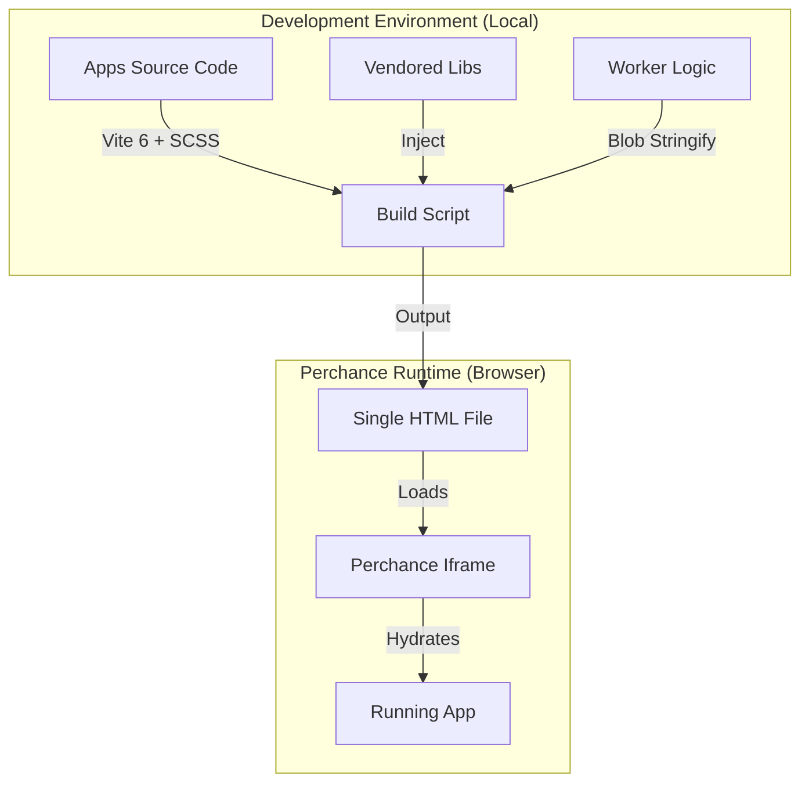

# RPGlitch

A next-generation AI Roleplay Engine built on Perchance, featuring a **Simulation-Driven Architecture** for immersive, consistent, and unrestricted storytelling.

## Overview

RPGlitch is a "Local-First" web application that turns your browser into a sophisticated RPG tabletop. It allows you to create custom Fractals and Characters, then engage in deep, coherent roleplay with an AI Game Master that adheres to strict narrative consistency rules.

## 🏗️ Architecture

### The Build Pipeline (Constraint-Based Engineering)

This explains how we turn a Monorepo into a Single File.

### The Runtime Data Flow (The Game Loop)

This explains the new WebWorker & Event Bus flow we just implemented.

```mermaid
sequenceDiagram
    participant User
    participant UI as 🖥️ UI
    participant Bus as 📢 EventBus
    participant Dir as 🎬 Director
    participant DB as 💾 Dexie
    participant AI as 🧠 LLM Service

    Note over User, AI: The "Prometheus" Turn Cycle

    User->>UI: Types Message
    UI->>DB: Save User Message
    UI->>Dir: send()

    rect rgb(20, 20, 20)
        Note right of Dir: Main Thread Execution
        Dir->>Dir: Calculate Physics (Reflex)
        Dir->>Dir: Build Prompt (ContextBuilder)

        Dir->>AI: LlmService.generate()
        AI-->>Dir: Response Text

        Dir->>DB: Save AI Message
        Dir->>DB: Update Entity States
    end

    Dir->>Bus: Dispatch "CHAT_REFRESH"
    Bus->>UI: Trigger Re-render
    UI->>DB: Fetch Latest Messages
    UI-->>User: Show Response
```

### The Simulation Engine

RPGlitch supersedes standard chatbot patterns by implementing a **Simulation Engine**. Instead of just generating text, the system calculates the "physics" of the narrative state in the background.

src/
├── gamemaster/ # 🕰️ Pillar 1: Logic & State (Chrono)
├── artificer/ # 🛠️ Pillar 2: Structure & UI Components
├── mesmer/ # 🎭 Pillar 3: Visuals, Audio & Theme
├── scholar/ # 📚 Pillar 4: Database & Persistence
└── warden/ # 🛡️ Pillar 5: Security & Bridge

## Technology Stack

- **State Management:** IndexedDB via Dexie.js (single source of truth)
- **UI Framework:** Svelte 5 (Runes) + Native SCSS
- **Bundler:** Vite 6
- **Security:** DOMPurify for XSS prevention

## Related Documentation

- **Philosophy:** [01-prime-directive.md](../.agent/rules/01-prime-directive.md)
- **Architecture:** [02-architecture.md](../.agent/rules/02-architecture.md)
- **UI/UX Guidelines:** [03-tech-stack.md](../.agent/rules/03-tech-stack.md)
- **Agent Protocol:** [AGENTS.md](../AGENTS.md)
