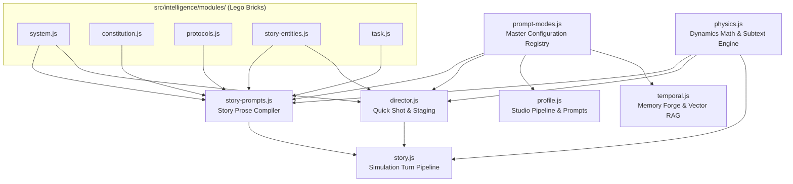

<!--
  src/intelligence/ Architectural Modularization & Domain Consolidation
  =============================================================================
  Purpose: Transform src/intelligence into a clean, decoupled architecture:
  1. Structural prompt modules in src/intelligence/modules/ (system, constitution, protocols, story-entities, task).
  2. Master configuration manifest at src/intelligence/prompt-modes.js.
  3. Domain consolidation:
     - physics.js (dynamics math + protocols + subtext XML)
     - director.js (staging + Quick Shot prompt + spotlight + parsing)
     - profile.js (profile studio pipeline + prompts)
     - temporal.js (temporal RAG pipeline + Memory Forge prompt)
     - story.js (simulation turn pipeline) & story-prompts.js (story prose compiler)
  4. Complete elimination of src/intelligence/prompts/.

  Compliance Rules:
  - P4 Zero Backwards Compatibility: Refactor all callers immediately; no shims or deprecated wrappers.
  - Universal File Architecture: Instructional header + section dividers + changelog footer on all files.
  - TDD Red-Green-Refactor: Verify all test suites continuously.
  =============================================================================
-->

# 🎯 Track: Intelligence Modularization & Domain Consolidation

## 1.0 Vision & Architectural Invariants

Transform `src/intelligence/` into a sovereign, domain-oriented architecture by decomposing monolithic prompt files into reusable structural modules and consolidating domain-specific prompts with their respective pipelines.

---

## 2.0 Playbook & Execution Checklist

### Phase 1: Structural Prompt Modules (`src/intelligence/modules/`)

- [x] Create `src/intelligence/modules/system.js` (extract `<SYSTEM>` wrapper, role lines, stability lock from `shared.js` and `interaction-prompt.js`).
- [x] Create `src/intelligence/modules/constitution.js` (extract `render_axiomatic_constitution` and constitution laws from `shared.js`).
- [x] Create `src/intelligence/modules/protocols.js` (extract `PROTOCOL_LIBRARY`, `render_core_protocols`, layout helpers, and affirmative framing).
- [x] Create `src/intelligence/modules/story-entities.js` (extract `render_entity_sheets`, sheet scoping, epistemic wall filters from `shared.js`).
- [x] Create `src/intelligence/modules/task.js` (extract `render_task`, `render_task_input`, `render_task_currents`, `build_recency_anchor`, pacing directive).
- [x] Verify `modules/*.test.js` unit tests.

### Phase 2: Domain Consolidation (Physics & Director)

- [x] Merge `src/intelligence/prompts/physics-protocols.js` into `src/intelligence/physics.js` and update `physics.test.js`.
- [x] Consolidate `src/intelligence/prompts/director-prompt.js` into `src/intelligence/director.js` and update `director.test.js`.
- [x] Verify unit tests for `physics.js` and `director.js`.

### Phase 3: Domain Consolidation (Profile & Temporal)

- [x] Merge `profile-pipeline.js` and `profile-prompts.js` into `src/intelligence/profile.js`.
- [x] Merge `temporal-pipeline.js` and `temporal-prompt.js` into `src/intelligence/temporal.js`.
- [x] Consolidate tests into `profile.test.js` and `temporal.test.js`.

### Phase 4: Story Consolidation & Master Manifest

- [x] Move `src/intelligence/prompts/prompt-modes.js` ➔ `src/intelligence/prompt-modes.js` and update `prompt-modes.test.js`.
- [x] Create `src/intelligence/story-prompts.js` uniting `interaction-prompt.js` and `narrator-prompt.js` leveraging `modules/`.
- [x] Rename `src/intelligence/story-pipeline.js` ➔ `src/intelligence/story.js` and update imports.
- [x] Remove obsolete files in `src/intelligence/prompts/` and delete directory.

### Phase 5: Verification & Quality Gate

- [x] Update all workspace imports (`src/intelligence/index.js`, `@intelligence`, components, state stores).
- [x] Run full test suite: `npm run test`.
- [x] Run hook contracts: `npm run test:hooks`.
- [x] Run production build: `npm run build`.
- [x] Synchronize `tasks/PRESENT.md`.

<!-- CHANGELOG
- 2026-09-11: Track initialized for Intelligence Modularization & Domain Consolidation.
- 2026-09-11: Completed Phases 1-5. All structural modules created, domain files consolidated, prompts/ directory eliminated, 66/66 test files (907 unit tests, 3 design tests, 13 hooks) passed with 0 errors.
-->
