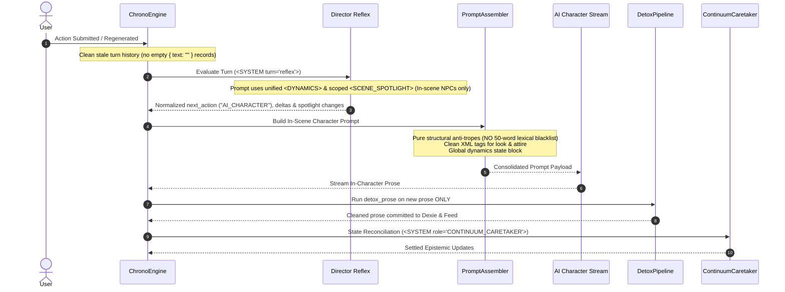

# 🎯 Track: Prompt Architecture Consolidation, Detox Remediation & Generation State Purity

## 1.0 Unified Vision & High-Level Architecture

Based on the forensic audit of live Perchance console execution in [`scrobbles.md`](file:///c:/Users/johng/source/repos/RPGlitch/scrobbles.md), this track delivers deep architectural consolidation and bugfixes across prompt assembly, text post-processing, and turn execution state:

1. **Prompt Consolidation & De-duplication**:

   - Merge `<DYNAMICS_LEGEND>` with live attribute values into a single unified `<DYNAMICS>` block.
   - Consolidate Director `<ROSTER>`, `<SCENE_ROSTER>`, and `<RELATIONAL_MESH>` into a single `<SCENE_SPOTLIGHT>` block scoped strictly to active in-scene entities (`runtime.in_scene_npc_ids`).
   - Standardize all prompt fields on clean XML tags (e.g. `<CLOTHING>`, `<EXPRESSION>`), eliminating lingering pseudo-JSON delimiters (`KEY: VALUE`).
   - Merge Director `in_scene_change` and `genesis` into a unified `spotlight` schema: `{ "enter": [...], "exit": [...], "genesis": { ... } }`.
   - Remove `<STATE_OF_MIND>` from Fractals in favor of `<ATMOSPHERE>`.
   - Unify `<CAST>`, `<ROLE>`, and `<ACTIVE_IDENTITY>` to eliminate 3x entity background repetition.

2. **Detox Post-Processing Remediation**:

   - Completely purge the 50-word lexical blacklist from character and director system prompts to eliminate prompt bloat and LLM "pink elephant" bias.
   - Refactor `detox_prose` so dictionary replacements run strictly on new AI narrative prose/dialogue chunks—never on stored conversation history records or telemetry strings.
   - Cleanse internal style presets (e.g. William Gibson's `"ozone"`) to avoid self-contradiction.

3. **Turn Regeneration & History Desync Fix**:

   - Fix race condition where rerolling or regenerating a turn leaves empty `{ text: "" }` entries in message history.
   - Enforce that turn resets and regenerations prune subsequent aborted turns from Dexie and the in-memory feed before launching the next prompt.
   - Clamp Director `next_action` normalization to prevent entity names (e.g. `"Orion the Pink Protector"`) from bypassing `"AI_CHARACTER"`.

---

## 2.0 Architectural Sequence & Data Flow

---

## 3.0 Implementation Playbook

### Phase 1: Test-Driven Red Suite (Prompt & State Contracts)

- [x] `task-1.1`: Add unit tests in `src/intelligence/prompts/shared.test.js` and `director-prompts.test.js` verifying:
  - `<DYNAMICS>` merges scale legend and live values into a single block with no entity tag attributes.
  - `<SCENE_SPOTLIGHT>` includes only active in-scene entities (`runtime.in_scene_npc_ids`), candidate secondaries, and scoped relational vectors.
  - Director schema specifies unified `spotlight: { enter, exit, genesis }`.
  - Director `next_action` normalizes character proper names to `"AI_CHARACTER"`.
- [x] `task-1.2`: Add unit tests in `src/intelligence/prompts/story-prompts.test.js` and `image-prompts.test.js` verifying:
  - System prompts omit the 50-word lexical blacklist and retain only affirmative structural formulas.
  - Fractals render `<ATMOSPHERE>` instead of `<STATE_OF_MIND>`.
  - Entities serialize physical look using clean XML tags (`<CLOTHING>`, `<EXPRESSION>`, `<POSTURE>`, etc.) instead of pseudo-JSON strings.
  - Ghostwrite prompt folds instructions cleanly inside `<TASK mode="GHOSTWRITE">` with no stray orphan tags, valid `<ROUND>`, and no consecutive blank lines.
  - Sensory Cortex image prompts wrap intent in `<INPUT_INTENT>...</INPUT_INTENT>`, embed either `<camera>` OR `<composition>` directly into Phase 2, embed `<medium>`/`<palette>` into Phase 4, embed `<texture>` into Phase 5, and unify keywords into Phase 1 `<AVAILABLE_KEYWORDS>` (completely eliminating the separate `<VISUAL_ENGINE>` block).
  - Narrative styles compile raw engine metadata directly into actionable rhythm, sensory order, and emotional resonance directives instead of disconnected XML data tables.
  - Recency anchors omit raw numeric dynamics leakage `(intensity=XX, affinity=YY)` in favor of qualitative acting tension.
  - Continuum Caretaker prompt uses semantic `<SYSTEM role="CONTINUUM_CARETAKER">` and `<IN_SCENE_PARTICIPANT>` instead of `<OTHER_ENTITY>`.
- [x] `task-1.3`: Add unit tests in `src/utils/styles.test.js` and `src/intelligence/story-pipeline.test.js` verifying:
  - `detox_prose` does not corrupt parts of speech or mangle words like "bellow" and "boom".
  - History prompts do not run word-substitution on historical messages.
  - Re-generating a turn cleans up prior aborted empty turns without leaving `{ role: 'ai', text: '' }`.

### Phase 2: Prompt Architecture & Schema Consolidation (GREEN)

- [x] `task-2.1`: Implement unified `<DYNAMICS>` block assembly in `src/intelligence/prompts/shared.js` and remove duplicate dynamics attributes from identity tags and recency anchors (items 1, 14, 15).
- [x] `task-2.2`: Consolidate `<ROSTER>`, `<SCENE_ROSTER>`, and `<RELATIONAL_MESH>` into `<SCENE_SPOTLIGHT>` in `src/intelligence/prompts/director-prompts.js` (items 4, 12). Ensure relational mesh vectors include ONLY relationships between active in-scene entities (`in_scene_npc_ids` + active trio), strictly pruning all vectors involving inactive/off-scene entities. Update normalization to accept unified `spotlight` schema (item 11) and clamp `next_action`.
- [x] `task-2.3`: Purge the 50-word lexical blacklist from `<ANTI_TROPES>` in `story-prompts.js`, `director-prompts.js`, and `physics-prompts.js`; replace with affirmative structural guidance (item 13).
- [x] `task-2.4`: Update Fractal state serialization in `story-prompts.js` to emit `<ATMOSPHERE>` instead of `<STATE_OF_MIND>` (item 2), de-duplicate Fractal/entity declarations across `<CAST>` and `<ACTIVE_IDENTITY>` (item 3), and serialize appearance/look into clean XML child tags (`<CLOTHING>`, `<EXPRESSION>`) (item 10).
- [x] `task-2.5`: Fix Ghostwrite prompt formatting in `story-prompts.js` to integrate `<GHOSTWRITE>` directly within `<TASK>` and cleanly format `<ROUND>` (item 18).
- [x] `task-2.6`: Update Sensory Cortex image prompt builder in `src/media/image-prompts.js`:
  - Wrap intent in `<INPUT_INTENT>...</INPUT_INTENT>` (item 6).
  - Remove redundant `<MODE>VISUALIZE</MODE>` tag (it echoes mode without functional purpose).
  - Embed either `<camera>` (lens optics) OR `<composition>` (non-lens artistic framing) directly in Phase 2 spatial framing.
  - Embed style medium and palette directly in Phase 4 instructions (item 5).
  - Embed style texture and affirmatively rephrase environmental grounding in Phase 5 (item 8).
  - Unify static and active style keywords into Phase 1 `<AVAILABLE_KEYWORDS>` (item 9), retiring the legacy disconnected `<VISUAL_ENGINE>` block.
- [x] `task-2.7`: Compile Narrative Style presets in `story-prompts.js` and `director-prompts.js`: translate `<DESCRIPTION>`, `<internal_ratio>`, `<sentence_rhythm>`, `<sensory_order>`, and `<emotion_grounding>` directly into execution directives (rhythm, sensory hierarchy, emotional resonance, and genre anchoring).
- [x] `task-2.8`: Integrate refined community storytelling principles into `PROTOCOL_LIBRARY` in `src/intelligence/prompts/shared.js`:
  - Genre Framing (Author's Note / genre anchoring priors).
  - Organic Gaze / Baseline Physical Attention (characters perceive silhouettes, revealing garments, and physical contours naturally during neutral moments).
  - Somatic Physicality (visceral granularity and lasting injury consequences during high-trauma events).
  - Affirmative Steering Strength ("encouraged / expected" in `FICTIONAL_LICENSE` and character autonomy).
- [x] `task-2.9`: Update Continuum Caretaker prompts: rename prompt header to `<SYSTEM role="CONTINUUM_CARETAKER">` (item 16) and serialize other present characters as `<IN_SCENE_PARTICIPANT>` instead of `<OTHER_ENTITY>` (item 17).

### Phase 3: Detox Post-Processing & Comprehensive Definitions Cleansing (GREEN)

- [x] `task-3.1`: Refactor `src/utils/styles.js` and `src/data/definitions/speaking-styles.js` to refine or remove overzealous word-level substitutions (`bellow`, `boom`, `hitch`) that destroy grammar.
- [x] `task-3.2`: Comprehensively cleanse and standardize the entire `src/data/definitions/` directory (`narrative-styles.js`, `speaking-styles.js`, `premade-entities.js`, `visual-styles.js`, `profile-fields.js`):
  - Rename `tags` ➔ `keywords` across all presets in both `visual-styles.js` and `narrative-styles.js` for strict taxonomy consistency with prompt `<keywords>` and `<AVAILABLE_KEYWORDS>`.
  - Maintain `llm_refine: false` semantics for raw photography/unmodified styles where LLM prompt rewriting would degrade natural raw prompts.
  - Purge self-contradictory tokens (e.g. replace `"ozone"` with `"ionized exhaust"` or `"sharp electric charge"`).
  - Remove destructive word-replacement rules that break parts of speech or produce unnatural dialogue.
  - Audit all premade entities, visual presets, and profile descriptors for purple prose crutches and cliché tropes.
- [x] `task-3.3`: Audit callers of `detox_prose` across `story-pipeline.js`, `render.js`, and prompt builders to ensure detox runs strictly on newly streamed generation output and never on raw history or telemetry strings.

### Phase 4: Turn Regeneration & Generation State Purity (GREEN)

- [x] `task-4.1`: Update `src/state/chrono.svelte.js` and `src/intelligence/story-pipeline.js` to ensure turn rerolls/regenerations prune any trailing empty `{ text: "" }` messages from Dexie and runtime arrays.
- [x] `task-4.2`: Update Sensory Cortex history formatting in `image-prompts.js` to strip unclosed `<think>` blocks and prevent raw metric telemetry strings from entering image prompt context.

### Phase 5: Verification & Quality Gate

- [x] `task-5.1`: Run full unit test suite `npm run test:unit` and ensure 100% pass across all test suites.
- [x] `task-5.2`: Run `npm run test:hooks` to verify all 14 lifecycle hook contracts pass.
- [x] `task-5.3`: Run `npm run audit:hygiene` ensuring 0 security, lexical, or legislative violations across all assets.
- [x] `task-5.4`: Run `npm run deploy:prepare` to verify single-file production compilation.

<!-- CHANGELOG
  - 2026-09-05: Track initialized via /planning and /grill-me session addressing all 18 console log findings from scrobbles.md.
-->
