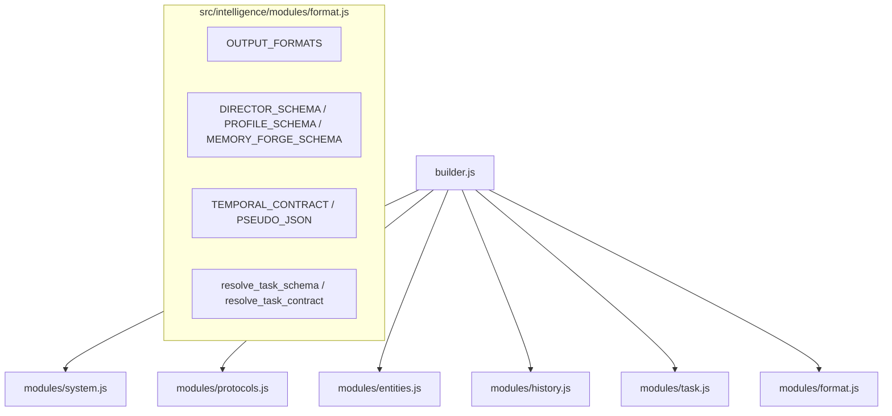

<!--
  src/intelligence/modules/format.js Modularization
  =============================================================================
  Purpose: Transform prompt output formatting and schema architecture:
  1. Create src/intelligence/modules/format.js consolidating:
     - OUTPUT_FORMATS (PROSE, BRACKETS, ARRAY_APPEND, ARRAY_SINGLE, JSON_OBJECT)
     - Schemas (DIRECTOR_SCHEMA, PROFILE_SCHEMA, MEMORY_FORGE_SCHEMA, TASK_SCHEMAS)
     - Contracts (TEMPORAL_CONTRACT, PSEUDO_JSON, TASK_CONTRACTS)
     - Output format rendering and schema resolvers.
  2. Purify src/intelligence/modules/task.js to focus purely on turn execution, pacing,
     somatic currents, input formatting, and action directives.
  3. Purify src/intelligence/modules/protocols.js by relocating PSEUDO_JSON and
     CORE.FORMAT to format.js.
  4. Update builder.js and test suites to consume format.js directly without shims.

  Compliance Rules:
  - P4 Zero Backwards Compatibility: Refactor all callers immediately; no shims or deprecated wrappers.
  - Universal File Architecture: Instructional header + section dividers + changelog footer on all files.
  - TDD Red-Green-Refactor: Verify all test suites continuously.
  =============================================================================
-->

# 🎯 Track: Prompt Format, Schemas & State Contract Modularization

## 1.0 Vision & Architectural Invariants

Decouple behavioral laws (`protocols.js`) and turn execution (`task.js`) from the output contract (`format.js`). Every prompt follows the clean logical flow:
`SYSTEM` ➔ `PROTOCOLS` ➔ `ENTITIES` ➔ `HISTORY` ➔ `TASK` ➔ `OUTPUT_FORMAT`.

---

## 2.0 Playbook & Execution Checklist

### Phase 1: Create `src/intelligence/modules/format.js` & Unit Tests

- [x] Create `src/intelligence/modules/format.js` with schemas, contracts, formats, and resolvers.
- [x] Create `src/intelligence/modules/format.test.js` validating schemas, formats, and resolution helpers.

### Phase 2: Refactor `src/intelligence/modules/task.js`

- [x] Remove schemas from task.js.
- [x] Remove contracts from task.js.
- [x] Relocate instruction renderers (`render_enhancement_instructions`, `render_profile_sorting_instructions`) to `task.js`.
- [x] Retain turn directives (`SCENE_DIRECTIVES`, `GHOSTWRITE_DIRECTIVES`, `CHARACTER_DIRECTIVES`, `SORTING_DIRECTIVES`, `DIRECTOR_TASK_RULES`), pacing, currents, input, and `render_task`.
- [x] Update internal references in `task.js`.

### Phase 3: Refactor `src/intelligence/modules/protocols.js`

- [x] Remove `STATE.PSEUDO_JSON` (relocated to `format.js`).
- [x] Reconcile `CORE.FORMAT` with `format.js`.
- [x] Verify `protocols.js` has zero formatting/schema clutter.

### Phase 4: Wire `builder.js`, Consumers & Tests

- [x] Update `src/intelligence/builder.js` imports to pull schemas/formats from `format.js`.
- [x] Update `profile.test.js`, `temporal.test.js`, and `format.test.js` imports and assertions.
- [x] Run full test suite: `npx vitest run src/intelligence/`.
- [x] Run hook contracts: `npm run test:hooks`.
- [x] Run linter: `npm run lint:js`.

<!-- CHANGELOG
- 2026-09-12: Initialized track for format.js and schema modularization.
-->
