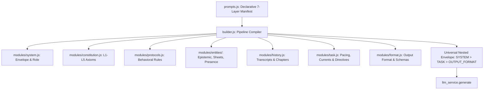

<!--
  tasks/future/track-prompt-pipeline-standardization-and-modularization.md
  ============================================================================
  🎯 TRACK SPECIFICATION — Prompt Pipeline Standardization & Modularization
  ============================================================================
  Sovereign implementation blueprint for prompt pipeline refactoring:
  1. Modularization of `entities.js` into submodules (`epistemic.js`, `sheets.js`, `presence.js`).
  2. Universal Nested Envelope standardization (`<SYSTEM ...><TASK>...</TASK></SYSTEM>`).
  3. Deduplication of Shot 1 Director schema and Layer 7 `<OUTPUT_FORMAT>` integration.
  4. Declarative 7-stage pipeline compiler in `builder.js`.
  5. Facade simplification and Epistemic Wall verification guard.
  ============================================================================
-->

# Track Specification: Prompt Pipeline Standardization & Modularization

## 1.0 Vision & Architecture

RPGlitch's prompt pipeline coordinates multiple simulation shots (Director, Story Prose, Continuum) and auxiliary tooling (Enhancement, Sorting). This track transforms the prompt pipeline into a clean, symmetric, modular, and token-efficient architecture:

---

## 2.0 Implementation Playbook

### Phase 1: `entities.js` Modular Decomposition

- [x] Write red tests in `src/intelligence/modules/entities.test.js` validating submodule imports and epistemic integrity.
- [x] Create `src/intelligence/modules/entities/epistemic.js` (`strip_epistemic_tags`, `strip_epistemic_secrets`, `verify_epistemic_integrity`).
- [x] Create `src/intelligence/modules/entities/sheets.js` (`extract_physical_body`, `SHEET_SPECS`, `render_sheet`, `render_entity_sheets`).
- [x] Create `src/intelligence/modules/entities/presence.js` (`resolve_available_entities`, `render_nearby_entities_xml`, `render_present_entities_xml`, `ROUTING_RULES`).
- [x] Create `src/intelligence/modules/entities/index.js` and convert `src/intelligence/modules/entities.js` to a clean barrel re-export.
- [x] Verify green tests on `entities.test.js` (28/28 tests passing).

### Phase 2: Universal Nested Envelope & Layer 7 Output Format

- [x] Update `src/intelligence/modules/system.js` to ensure clean nesting of `<TASK>` inside `<SYSTEM>`.
- [x] Update `src/intelligence/modules/format.js` and `render_output_format_xml` across all modes.
- [x] Update `src/intelligence/modules/task.js`:
  - [x] Remove duplicate schema injection from `render_protocols` in Shot 1; emit exclusively via `<OUTPUT_FORMAT mode="json">` in `<TASK>`.
  - [x] Integrate `<OUTPUT_FORMAT mode="prose">` for Story Prose.
  - [x] Add active entity speaking style / voice cues to `<DELIVERY_POSTURE>`.
- [x] Update `src/platform/transport.js` to eliminate `system_close` handling and support universal nested envelopes.
- [x] Verify green tests on `format.test.js` and `transport.test.js`.

### Phase 3: Declarative Pipeline Runner & Facade Consolidation

- [x] Register `director_terse` mode in `src/intelligence/prompts.js`.
- [x] Refactor `src/intelligence/builder.js`:
  - [x] Implement `compile_pipeline_prompt(mode_key, context)` executing the 7 manifest layers.
  - [x] Symmetrically compile all prompt shots into `<SYSTEM><TASK></TASK></SYSTEM>`.
  - [x] Consolidate facade into `build_director`, `build_story_prose`, `build_continuum`, `build_enhancement`, `build_sorting`, `build_terse_director_task`.
  - [x] Add runtime Epistemic Wall verification guard.
- [x] Verify green tests on `builder.test.js` and `prompts.test.js`.

### Phase 4: Domain Consumer Alignment & Intelligence Verification

- [x] Align `src/intelligence/director.js` with consolidated builder methods.
- [x] Align `src/intelligence/story.js` with `build_story_prose` and pruned `system_close`.
- [x] Align `src/intelligence/temporal.js` with continuum prompt output.
- [x] Run intelligence and platform test suites: `npx vitest run src/intelligence` and `npx vitest run src/platform`.

### Phase 5: Unified Enhancement & Optics Pipeline Integration

- [x] Create `src/intelligence/optics.js` absorbing 5-phase Optics Builder protocol and cinematography framing from `src/media/image-prompts.js`.
- [x] Move response parsers (`parse_llm_image_prompt_response`, `strip_proper_names`, `clean_image_prompt`) into `src/intelligence/parser.js`.
- [x] Expose `build_visual_enhancement` / `build_optics_prompt` from `prompt_builder`.
- [x] Update `src/media/visual.svelte.js` to import compilation and parsing from `@intelligence`.
- [x] Relocate `src/media/image-prompts.test.js` to `src/intelligence/optics.test.js` and delete `src/media/image-prompts.js`.
- [x] Run full test suites: `npm run test`, `npm run test:hooks`, `npm run verify`, `npm run build`.

---

<!-- CHANGELOG
- 2026-09-18: Track initialized with Phase 5 Unified Enhancement & Optics Pipeline Integration.
-->
