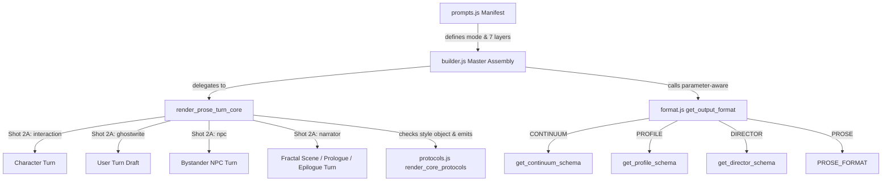

# 🎯 Track: Prompt Pipeline Symmetry, Style-Object Plumbing & Architectural Harmonization

## 1.0 Vision & High-Level Architecture

Harmonize the RPGlitch Intelligence Kernel prompt generation pipeline across `src/intelligence/builder.js`, `src/intelligence/prompts.js`, and its structural modules (`protocols.js`, `format.js`, `task.js`), resolving all 7 structural inconsistencies and defects audited in `scrabbles.md`:

1. **Eliminate Narrator Style Regression**: Resolve full `NarrativeStyle` objects in `render_scene_narrator` and pass dynamics snapshots to `render_task`, eliminating the malformed `<NARRATIVE_STYLE origin="UNDEFINED">` leak and restoring lost style DNA and somatic subtext triggers.
2. **Make Manifest Layer 7 Load-Bearing**: Upgrade `get_output_format` in `format.js` to be parameter-aware, unifying schema routing for `DIRECTOR`, `CONTINUUM`, `PROFILE`, and `PROSE` across all modes in `builder.js`.
3. **Extract Symmetrical Prose Core**: Collapse the ~90% code duplication between `render_story_prose` and `render_scene_narrator` into a single shared `render_prose_turn_core` pipeline.
4. **Normalize XML Lexicon**: Standardize `<SIGNUM>` in `protocols.js` to the canonical `<SIGNATURE_ELEMENTS>` defined in `narrative-styles.js` and `DESIGN.md`.
5. **Harmonize Shot-2A History Window**: Set explicit `history: { limit: 16 }` across all four Shot-2A prose sibling modes (`interaction`, `ghostwrite`, `npc`, `narrator`).
6. **Preserve Domain Layer Prompt-Free Purity**: Export `THINK_OPEN_TAG` from `parser.js` and consume it in `story.js`, eliminating raw prompt markup strings from domain execution.
7. **Complete Test Suite Matrix**: Add comprehensive tests in `src/intelligence/builder.test.js` and `prompts.test.js` validating style-object plumbing, recency dynamics, and schema routing for all four Shot-2A modes.

---

## 2.0 Technical Architecture & Layer Flow

---

## 3.0 Implementation Playbook

### Phase 1: Test-Driven Red Suite (Failing Tests)

- [x] 70ecaac `task-1.1`: Create `src/intelligence/builder.test.js` asserting non-default narrative style plumbing for `render_narrator_prose` (proves `<NARRATIVE_STYLE origin="UNDEFINED">` bug and asserts valid `<SIGNATURE_ELEMENTS>` and style DNA).
- [x] 70ecaac `task-1.2`: Add unit tests in `src/intelligence/modules/format.test.js` for parameter-aware `get_output_format` routing (`CONTINUUM`, `PROFILE`, `DIRECTOR`, `PROSE`).

### Phase 2: Core Prompt Pipeline Symmetrical Consolidation (GREEN)

- [x] 70ecaac `task-2.1`: In `src/intelligence/modules/protocols.js`, update `render_core_protocols` to replace `<SIGNUM>` with `<SIGNATURE_ELEMENTS>` and guard style check (`style?.id && style.id !== "default"`).
- [x] 70ecaac `task-2.2`: In `src/intelligence/modules/format.js`, enhance `get_output_format` with entity-type parameter support and fallback routing.
- [x] 70ecaac `task-2.3`: In `src/intelligence/builder.js`, extract `render_prose_turn_core`, unify `render_story_prose` and `render_scene_narrator`, fix style resolution to `get_narrative_style(resolve_active_style_key())`, pass `snapshot` into narrator `render_task`, and wire `get_output_format` for `render_memory`, `render_profile_sorting`, and `render_enhancement`.

### Phase 3: Manifest, Domain Hygiene & Clean Sibling Alignment (GREEN)

- [x] 70ecaac `task-3.1`: In `src/intelligence/prompts.js`, explicitly declare `history: { limit: 16 }` for `ghostwrite`, `npc`, and `narrator`.
- [x] 70ecaac `task-3.2`: In `src/intelligence/parser.js`, export `THINK_OPEN_TAG = "<THINK>"`.
- [x] 70ecaac `task-3.3`: In `src/intelligence/story.js`, import `THINK_OPEN_TAG` from `./parser.js` and replace hardcoded literal `<THINK>`.

### Phase 4: Full Verification & Audit

- [x] 70ecaac `task-4.1`: Run vitest on full intelligence test matrix (`npx vitest run src/intelligence`).
- [x] 70ecaac `task-4.2`: Run complete test suite (`npm test`), hook contracts (`npm run test:hooks`), and verify zero linter errors.

---

<!-- CHANGELOG
  - 2026-09-15: Completed all 4 phases with 100% test matrix pass (976 unit tests, 13 hook contracts) in commit 70ecaac.
  - 2026-09-15: Initialized blueprint addressing all 7 code review items from scrabbles.md.
-->
