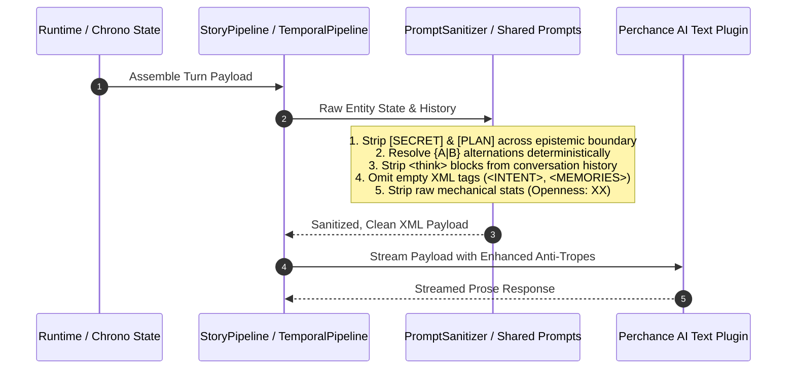

# 🎯 Track: Prompt Sanitization, Epistemic Leak Prevention & Narrative Drift Guards

## 1.0 Vision & Background Analysis

This track hardens prompt generation, context telemetry, and narrative governance pipelines against structural bloat, epistemic leaks, and subtle narrative drift discovered during Perchance testing.

### 1.1 Complete Forensic Analysis from `scrobbles.md`

Based on a forensic audit of the testing logs in `scrobbles.md` (spanning Prologue, Round 0, Round 1, Epilogue, Sensory Cortex image synthesis, and Memory Forge stages):

#### A. Narrative Drift & Behavioral Anomalies
1. **Denial-then-Affirmation Trope Breaches (`"I don't just X, I Y"`)**:
   - In Round 0 (AI Character turn, lines 637–641), Orion generated:
     > *"I don't just jump; I launch. I feel the pavement recoil under my heels..."*
     > *"I don't just step toward him; I invade..."* (Round 1, line 1323)
   - **Root Cause**: While `<ANTI_TROPES>` explicitly lists denial-then-affirmation in rule 2 (`'X didn't just Y; it Z'd'`), models miss the contraction and present-tense variants (`"I don't just..."`, `"He didn't simply..."`, `"not merely"`). The blacklist needs explicit structural patterns for `"don't just"` / `"didn't just"` / `"not merely"`.
2. **Epistemic Leaks Across the Fourth Wall (`[SECRET]` & `[PLAN]` in Snapshot State)**:
   - In Round 1 (Director / Ghostwrite input, lines 856, 1376, 1851):
     `<STATE_OF_MIND>[SECRET: fears being unloved as Rafael] [PLAN: bait Glitch into a public confrontation] Orion is buzzing with adrenaline...</STATE_OF_MIND>`
   - **Root Cause**: Orion's private `[SECRET]` and `[PLAN]` were serialized verbatim into the prompt rendered for Glitch's ghostwrite turn and subsequent state snapshots. Even though the protocol states *"Unvoiced thoughts are Null Data"*, the raw string `[SECRET: ...]` leaked across the epistemic barrier into the opposite character's prompt.
   - **Resolution**: Filter and strip `[SECRET: ...]` and `[PLAN: ...]` tags when rendering `<STATE_OF_MIND>` for any entity other than the entity itself (as mandated by local `GEMINI.md`).
3. **Character Agency Stealing in Sensory Synthesis / Epilogue**:
   - In line 138, the Prologue text dictated Orion's internal motive: *"the genuine thrill of a predator who has finally spotted his favorite prey"*, and Orion echoed Glitch's physical proximity before Glitch took an action.
   - In the Epilogue (lines 1901–1907), the generator resolved the conflict by dictating physical submission (*"Glitch is pinned beneath that mass... held fast by the crushing weight..."*), overriding user agency in an omniscient sweep without an active player choice.
4. **Tone & Style Clashing (Visceral Erotica vs. Heroic Himbo Puns)**:
   - Orion's personality is pure golden-retriever superhero puns (*"Stay strong, citizens!"*), but the Samuel Delany narrative style preset (`visceral queer erotica, precise bodily mechanics, urban decay`) dragged his interior dialogue into heavy, predatory, clinical anatomical descriptions (*"shelf of my pectorals"*, *"the friction of skin against skin"*).
   - This caused Orion to sound like two different characters fighting for control: shouting campy puns one moment, narrating like a transgressive philosophy professor the next.

#### B. Undesired To-and-From & Telemetry Waste
1. **Truncated History Entries in Memory Forge & Sensory Cortex**:
   - In lines 185–187, 709–724, 1396–1430, and 1956–1963, history entries are truncated mid-sentence with raw XML tokens:

     ```text
     "text": "&lt;think&gt;\n- Fractal Demand: Nova City requires a contrast between... alternating between civic"
     ```

   - **Problems**:
     - Sending `<think>` blocks into subsequent turns wastes hundreds of prompt tokens.
     - Sending truncated sentences (`"civic"`, `"as a hero, but as "`) trains the LLM on broken syntax and encourages abrupt halts.
   - **Resolution**: Strip `<think>...</think>` entirely from `CONVERSATION_HISTORY` and `INPUT_HISTORY`. If truncating long messages for context budgeting, truncate at full sentence or paragraph boundaries.
2. **Redundant XML Double-Nesting in Prompts**:
   - Prompts contain massive duplication between:
     - `<CAST>` vs `<ACTIVE_CHARACTERS>` vs `<SNAPSHOT><YOUR_IDENTITY>` vs `<SCENE_ROSTER>`.
     - Character appearance is repeated up to 3 times in a single prompt (once in `<CAST>`, once in `<ETERNAL>`, once in `<PRESENT>`).
   - In Perchance where context windows and generation speeds are sensitive, this redundancy costs ~800–1,200 wasted tokens per call.
3. **Round Progression Inconsistency**:
   - Notice lines 104, 442, 605, and 883: `<ROUND>0</ROUND>` or `<ROUND></ROUND>` was emitted across multiple turns before finally reaching `<ROUND>1</ROUND>`. This indicates ChronoEngine round advancement was lagging behind intermediate tool calls (Director Quick Shot vs AI Character).
4. **Ghostwrite Redundant Block Structure**:
   - In lines 885–894, the prompt contains both `<TASK>` with a reference to `<GHOSTWRITE>`, and then a separate `<GHOSTWRITE>` tag outside `<TASK>`. Folding `<GHOSTWRITE>` directly into `<TASK>` simplifies instruction hierarchy.

#### C. Prompt Formatting & Structural Enhancements
1. **Clean Up Pseudo-JSON Formatting in State Strings**:
   - Currently, present state in `<CURRENT_LOOK>` is formatted as:
     `CLOTHING: white sailor harness, metallic blue short shorts EXPRESSION: cheerful flexing smile POSTURE: dominant power-pose CONDITION: glistening with athletic sweat LOCATION: Nova City Upper Plazas`
   - Without brackets or linebreaks separating key-value pairs, LLM tokenizers blur keys together (`sweat LOCATION:`, `short shorts EXPRESSION:`).
   - **Resolution**: Enforce bracketed keys `[KEY: value]` or clear delimiter spacing.
2. **Purge Unresolved Alternation Syntax (`{A|B}`) Before LLM Ingestion**:
   - In lines 75, 81, 214, 232, 327, 335, 569, 576:
     `CLOTHING: {clad in a masculine Sailor Moon-inspired white sailor harness...|wearing a tight white tank top...}`
   - The engine is passing raw Perchance curly-brace alternation syntax directly into the AI prompt! The LLM is instructed in Phase 3 to *"resolve it to exactly ONE option"*, burdening the model with dice-rolling logic that should happen deterministically on the client before prompt generation.
3. **Empty XML Tags Cluttering the Context**:
   - Repeated empty tags across prompts (lines 70–71, 76–77, 82, 328–329, 336–337, 343–344, 570–571, 577, 583–584):
     `<INTENT></INTENT>`, `<MEMORIES></MEMORIES>`, `<AGENDA></AGENDA>`, `<BACKSTORY></BACKSTORY>`.
   - **Resolution**: Conditionally omit empty tags in prompt builders rather than emitting empty XML shells.
4. **Scene Roster / Openness Leakage**:
   - In lines 89–91, 421–423, 590–592:
     `- Beast (id: beast) (Openness: 42)`
     `- Hank 'Rust' Brawley (id: rust) (Openness: 43)`
   - Exposing internal statistical numbers like `(Openness: 42)` to creative prompts leaks mechanical noise and encourages models to treat entities as stats rather than living personas.

---

## 2.0 Architectural Sequence & Data Flow



---

## 3.0 Implementation Playbook

### Phase 1: Test-Driven Red Suite (Unit & Contract Tests)

- [ ] `task-1.1`: Add unit tests in `src/intelligence/prompts/shared.test.js` verifying that:
  - `[SECRET: ...]` and `[PLAN: ...]` are stripped from `<STATE_OF_MIND>` when rendered for other entities (epistemic boundary test).
  - Empty XML tags (`<INTENT></INTENT>`, `<MEMORIES></MEMORIES>`, `<AGENDA></AGENDA>`, `<BACKSTORY></BACKSTORY>`) are omitted from output blocks.
  - Perchance alternation syntax `{Option A|Option B}` is resolved to a single choice before prompt assembly.
  - Mechanical stat numbers like `(Openness: 42)` are stripped from scene roster rendering.
- [ ] `task-1.2`: Add unit tests in `src/intelligence/story-pipeline.test.js` and `src/intelligence/temporal-pipeline.test.js` verifying that:
  - `<think>...</think>` blocks are pruned from `CONVERSATION_HISTORY` and `INPUT_HISTORY`.
  - History truncation operates cleanly on sentence/paragraph boundaries rather than mid-word.
  - Ghostwrite prompts merge `<GHOSTWRITE>` directly inside `<TASK>` without redundant outer tags.
- [ ] `task-1.3`: Add unit tests in `src/intelligence/prompts/story-prompts.test.js` confirming anti-trope blacklist contains explicit patterns for denial-then-affirmation variations (`"I don't just..."`, `"didn't just"`, `"not merely"`).

### Phase 2: Prompt Sanitizer & Epistemic Boundary Implementation (GREEN)

- [ ] `task-2.1`: Implement `strip_epistemic_secrets(state_text, is_owner)` in `src/intelligence/prompts/shared.js` to strip `[SECRET: ...]` and `[PLAN: ...]` unless the recipient is the entity itself or the Director.
- [ ] `task-2.2`: Update XML builder functions in `src/intelligence/prompts/shared.js` and `builder.js` to conditionally omit empty tags (`render_optional_tag(name, content)`).
- [ ] `task-2.3`: Implement client-side alternation resolver `resolve_alternations(text)` in `src/intelligence/prompts/shared.js` so `{A|B}` is resolved deterministically before sending to LLM.
- [ ] `task-2.4`: Update `render_scene_roster` in `src/intelligence/prompts/shared.js` to strip internal dynamic state tags (`Openness: XX`) from narrative prompts.

### Phase 3: Telemetry & History Pruning (GREEN)

- [ ] `task-3.1`: Update `src/intelligence/story-pipeline.js` to strip `<think>...</think>` blocks when pushing or formatting messages for `CONVERSATION_HISTORY` and `INPUT_HISTORY`.
- [ ] `task-3.2`: Harden string truncation in `src/intelligence/temporal-pipeline.js` to respect sentence/paragraph boundaries and avoid raw mid-token slices.
- [ ] `task-3.3`: Refactor ghostwrite prompt generator in `src/intelligence/prompts/story-prompts.js` to fold ghostwrite instructions directly inside `<TASK>`.

### Phase 4: Anti-Trope & Narrative Governance Hardening (GREEN)

- [ ] `task-4.1`: Expand `<ANTI_TROPES>` in `src/intelligence/prompts/story-prompts.js`, `director-prompts.js`, and `physics-prompts.js` with explicit denial-then-affirmation triggers:
  - Pattern: `"I don't just [verb]; I [verb]"`, `"didn't just"`, `"not merely"`, `"doesn't simply"`.
- [ ] `task-4.2`: Refine Epilogue prompt in `src/intelligence/prompts/story-prompts.js` to reinforce user agency, ensuring epilogues respect user boundaries and lingering sensation without forcing total physical submission.

### Phase 5: Verification & Quality Gate

- [ ] `task-5.1`: Execute full test suite `npm run test:unit` and verify all tests pass.
- [ ] `task-5.2`: Run `npm run test:hooks` to confirm all 11 lifecycle hook contracts pass.
- [ ] `task-5.3`: Run `npm run audit:hygiene` to ensure zero security, lexical, or legislative violations.
- [ ] `task-5.4`: Run `npm run build` to verify clean single-file production compilation.

<!-- CHANGELOG
  - 2026-09-05: Initialized track file based on comprehensive forensic analysis of scrobbles.md, targeting prompt sanitization, epistemic leak prevention, anti-trope hardening, and telemetry pruning.
-->
