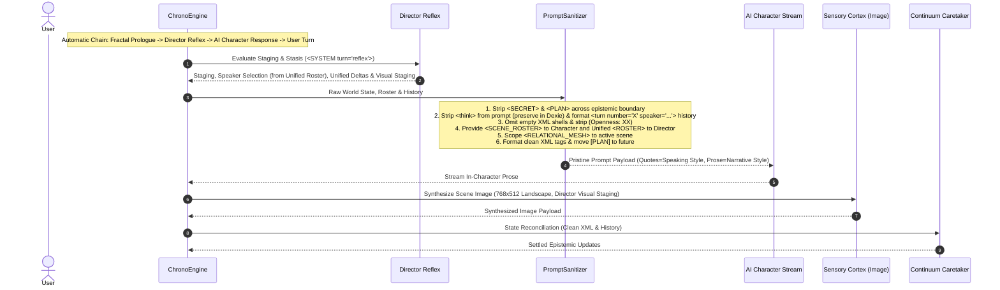

# 🎯 Track: Prompt Sanitization, Epistemic Boundary Hardening & Narrative Governance

## 1.0 Unified Vision & Architecture

This track hardens prompt generation, context telemetry, narrative agency, and visual sensory synthesis based on the comprehensive audit of [`scrobbles.md`](file:///c:/Users/johng/source/repos/RPGlitch/scrobbles.md) and [`scribbles.md`](file:///c:/Users/johng/source/repos/RPGlitch/scribbles.md).

### 1.1 Story Opening Sequence Lifecycle

The story opening sequence follows a strict deterministic, fully automatic chain:

```text
[1. Story Genesis] ➔ [2. Fractal Prologue (TTS & Feed Committed)] ➔ [3. Director Reflex] ➔ [4. AI Character Response (TTS & Feed Committed)] ➔ [5. User Turn Release]
```

- **Opening Chain & Commit Gating**: As soon as Fractal Prologue finishes streaming, it fully commits its DOM state, Dexie record, and audio trigger to `visible_feed`, immediately launching the Director Reflex ➔ AI Character Response turn without user friction.
- **The Overwrite Bug**: In `story-pipeline.js`, the incoming AI Character stream previously started before the Fractal Prologue had finalized its DOM and TTS state. Each step now strictly awaits full message commitment before triggering the next stage.

---

## 2.0 Decisions & Structural Agreements

### A. Narrative Agency & Anti-Trope Governance

1. **Denial-then-Affirmation Blacklist**: Explicitly ban first-person present and contraction formulas: `"I don't just [verb]; I [verb]"`, `"didn't just"`, `"not merely"`, `"doesn't simply"`.
2. **Affirmative Drift Audit Rules**: Rephrase all 5 `<DRIFT_AUDIT>` rules into affirmative expectations; allow natural courtesy for polite/courteous archetypes rather than forcing generic hostility.
3. **Dialogue Quotes vs. Narrative Prose Separation (Dual Tone Synthesis)**:
   - In the character prompt, explicitly declare: `"Use the character's speaking style strictly for words within quotation marks; render all surrounding narrative prose and environmental descriptions through the narrative style preset."`
   - Inside `"quotes"`: Dictated strictly by the character's **Speaking Style & Personality** (e.g., Orion's himbo superhero puns).
   - Outside quotes: Dictated strictly by the **Narrative Style Preset** (e.g., Delany transgressive/anatomical prose, pacing, and atmosphere).
4. **Epistemic Fourth-Wall Guards**: Strip `<SECRET>` and `<PLAN>` tags when rendering state across entity boundaries.
5. **Decouple Plan from Present (P4 Purge / No Legacy Shim)**: Move `[PLAN: ...]` out of `present.non_physical` into `future` (standing agenda); reserve `present.non_physical` strictly for immediate state of mind and active emotions. No legacy fallback shims needed (db reset before test session).
6. **Epilogue Agency Guard**: Epilogues must depict environmental aftermath and lingering sensation without forcing player physical surrender.
7. **Lexical Blacklist Refinement**: Strip over-eager banned words (like "bellow/boom" or "rasp") from the global lexical blacklist when they naturally fit character voices; reserve blacklist strictly for structural AI tropes.

### B. Prompt Architecture & De-duplication

1. **XML Tag Standard**: All prompts standardize cleanly on explicit XML tags (`<TAG>value</TAG>`), phasing out ambiguous unbracketed pseudo-JSON. Keep Perchance alternation syntax `{Option A|Option B}` intact as designed.
2. **Telemetry & Dynamic Values Consolidation**:
   - Merge `<DYNAMICS_LEGEND>`, current values, and dynamic deltas into a single unified `<DYNAMICS>` block.
   - Merge `dynamics_deltas` and `fractal_dynamics_deltas` into a single flat JSON object: `{ chaos, intensity, openness, affinity, velocity, entropy }`.
3. **Turn Identification in System Tags**:
   - Label system prompts with clean operational slices: e.g. `<SYSTEM role="DIRECTOR" turn="reflex">` or `<SYSTEM role="AI_CHARACTER" turn="response">`.
4. **Conversation History Schema & Thinking Separation**:
   - Semantic history tags with turn numbers: `<turn number="X" speaker="Entity Name">...content...</turn>`.
   - **Collapsible Inspector / Clean Context**: Strip unvoiced `<think>...</think>` blocks regex-cleanly before formatting prompts to save ~300–600 tokens per turn, but preserve `<think>` in Dexie message records (`thinking` column) so the user can inspect internal calculations in the UI if desired.
5. **Instruction Purity**:
   - Define directives organically without meta-fluff (`"the eternal blabla declared above"`, `"follow instructions below"`).
   - Merge ghostwrite instructions directly inside `<TASK>`.
   - Merge somatic directives, dynamic signals, and recency anchors into a unified `<MOMENTUM>` block.
   - Merge keyword lists into a single `<KEYWORDS>` block.
   - Omit empty XML shells (`<INTENT></INTENT>`, `<MEMORIES></MEMORIES>`) via `render_optional_tag`.
   - Strip redundant `<dna>` wrapper in narrative styles.
   - Purge redundant `<ANCHOR>` tag (covered by epistemic rules).
6. **Roster as Speaker Routing Palette**:
   - Merge `<SPEAKER_ROUTING>`, `<ENTITY_CONVERGENCE>`, `<ROSTER>`, and `<SCENE_ROSTER>` into a single unified `<ROSTER>` block for the Director:
     - Defines options cleanly: `"AI_CHARACTER"`, `"FRACTAL"`, in-scene NPCs (`"npc:<id>"`), and `"GENESIS"`.
     - Explicitly instructs using existing candidate NPCs before minting brand-new characters.
   - Character narrative prompts receive only in-scene participants in `<SCENE_ROSTER>`.
   - Strip mechanical telemetry `(Openness: XX)` from all narrative rosters.
   - Scope `<RELATIONAL_MESH>` strictly to active scene participants.
   - Clean Genesis directive: remove optional signature color and speaking style from Director prompt (confirmed already present in canonical `profile-prompts.js`).
7. **Continuum Caretaker**: Formally rename background state consolidation role to `CONTINUUM_CARETAKER`.

### C. Sensory Cortex & Visual Refinements

1. **Canonical Landscape Resolution Specs**:
   - Use the official engine tier resolution `story_scene` (`768x512`, 3:2 landscape) for Fractal profile pictures and narrative scene shots (replacing square `768x768` story entities when in landscape mode).
2. **Fractal Enhancer Wording**: Use affirmative focus on wide-angle architecture, atmospheric lighting, and weather scale without mentioning humans.
3. **Director Visual Staging via Separate System Shot**:
   - The Director evaluates physical/mechanical state and passes an unseen `"visual_staging"` note to the separate Sensory Cortex image generation pipeline.
4. **Visual Engine Nomenclature**: Change `<tags>` to `<keywords>` in `<VISUAL_ENGINE>` to align with `KEYWORD_INTEGRITY`.
5. **Lighting & Protocol Simplification**:
   - Remove generic `"ground scenes in real world light sources"` from Sensory Cortex protocols; let the chosen visual style govern lighting optics.
   - Purge clunky special-case `Prologue Priority` clause; enforce that all shots depict active narrative moments.
6. **Cinematography Merge**: Merge `<NARRATIVE_CONTEXT>` and `<CINEMATIC_FRAMING>` into a single unified `<CINEMATOGRAPHY>` block.
7. **Shimmer Harmonization**: Soften image generation shimmer gradient stops and sweep timing in `Shimmer.svelte`.

---

## 3.0 Architectural Sequence & Data Flow



---

## 4.0 Implementation Playbook

### Phase 1: Test-Driven Red Suite (Unit & Contract Tests)

- [x] `task-1.1`: Add unit tests in `src/intelligence/prompts/shared.test.js` verifying:
  - Epistemic boundary: `<SECRET>` and `<PLAN>` stripped from `<STATE_OF_MIND>` when rendered for opposing entities, and `[PLAN]` moved to `future`.
  - Empty tag omission: `<INTENT>`, `<MEMORIES>`, `<AGENDA>`, `<BACKSTORY>` omitted when empty via `render_optional_tag`.
  - Scene roster cleaning: `(Openness: XX)` stripped from `<SCENE_ROSTER>`; only `in_scene` entities rendered for character prompts.
  - Unified Director `<ROSTER>`: Combines speaker routing candidates, convergence rules, and roster entities into a single clean block.
  - Relational mesh scoping: Relationships outside active scene entities filtered out.
  - XML tag formatting across character and fractal state.
- [x] `task-1.2`: Add unit tests in `src/intelligence/story-pipeline.test.js` and `src/intelligence/temporal-pipeline.test.js` verifying:
  - Opening story chain: Fractal Prologue commits to feed before AI Character turn begins automatically.
  - `<think>...</think>` blocks stripped from history prompts, while preserved in database message records.
  - History items render as `<turn number="..." speaker="...">`.
  - Ghostwrite prompt folds instructions cleanly inside `<TASK>`.
  - Continuum Caretaker naming and flat `dynamics_deltas` schema.
- [x] `task-1.3`: Add unit tests in `src/intelligence/prompts/story-prompts.test.js` and `director-prompts.test.js` verifying:
  - Anti-trope blacklist detects `"I don't just..."`, `"didn't just"`, and `"not merely"`.
  - All 5 `<DRIFT_AUDIT>` rules use affirmative phrasing.
  - Speaking style applies to dialogue quotes; narrative style governs surrounding prose.
  - Epilogue prompts forbid forcing player physical submission.
  - Director Genesis excludes signature color and speaking style (delegated to profile creation).
- [x] `task-1.4`: Add unit tests in `src/media/visual.test.js` or `src/intelligence/sensory.test.js` verifying:
  - Fractal profile pictures and narrative group shots map to canonical landscape tier `story_scene` (`768x512`).
  - Director `"visual_staging"` passes into separate Sensory Cortex image prompt builder.
  - Sensory Cortex uses `<keywords>` instead of `<tags>` in `<VISUAL_ENGINE>`, and `<CINEMATOGRAPHY>` merges narrative context, framing, and purges `Prologue Priority`.

### Phase 2: Prompt Sanitizer, Epistemic Boundary & Unified Roster (GREEN)

- [x] `task-2.1`: Implement `strip_epistemic_secrets(state_text, is_owner)` across all prompts and extract `[PLAN]` into `future`.
- [x] `task-2.2`: Wire `render_optional_tag(tag_name, content)` in `story-prompts.js`, `director-prompts.js`, and `builder.js` to purge empty XML shells.
- [x] `task-2.3`: Merge `<SPEAKER_ROUTING>`, `<ENTITY_CONVERGENCE>`, and `<ROSTER>` into the unified Director `<ROSTER>` block in `src/intelligence/prompts/director-prompts.js`, strip mechanical telemetry, and scope `<RELATIONAL_MESH>`.
- [x] `task-2.4`: Standardize XML tag serialization for character/fractal states and strip `<dna>` wrapper from narrative style templates.

### Phase 3: Telemetry, Opening Sequence & Continuum Caretaker (GREEN)

- [x] `task-3.1`: Fix Prologue sequence in `src/intelligence/story-pipeline.js` ensuring Fractal Prologue commits fully before auto-chaining Director Reflex and AI Character, with end-to-end integration test.
- [x] `task-3.2`: Update history formatting to strip `<think>...</think>` blocks for prompt construction while storing them in the message record, and serialize semantic `<turn number="..." speaker="...">` tags.
- [x] `task-3.3`: Completely purge `fractal_dynamics_deltas` across prompt schema, director normalization, story pipeline, and test suites in favor of unified 6-axis `dynamics_deltas`.
- [x] `task-3.4`: Refactor ghostwrite prompt assembly in `src/intelligence/prompts/story-prompts.js` to fold into `<TASK>`.

### Phase 4: Anti-Trope Governance & Sensory Cortex Refinement (GREEN)

- [x] `task-4.1`: Update `<ANTI_TROPES>` in `story-prompts.js`, `director-prompts.js`, and `physics-prompts.js` with explicit denial-then-affirmation formulas and prune natural character words from lexical blacklist.
- [x] `task-4.2`: Update `<DRIFT_AUDIT>` rules with affirmative phrasing and enforce quotes-for-speaking-style vs prose-for-narrative-style.
- [x] `task-4.3`: Update aspect ratio defaults in image generation calls: map Fractal profiles and scene group shots to canonical `story_scene` (`768x512`).
- [x] `task-4.4`: Update Fractal enhancer prompt to affirmative environmental scaling without negative human triggers.
- [x] `task-4.5`: Wire Director `"visual_staging"` into Sensory Cortex, align `<keywords>` tag nomenclature, merge staging into `<CINEMATOGRAPHY>`, and purge duplicate `<CINEMATIC_FRAMING>`.
- [x] `task-4.6`: Soften image shimmer contrast and sweep speed in `src/ui/motion/Shimmer.svelte`.

### Phase 5: Verification & Quality Gate

- [x] `task-5.1`: Run full unit test suite `npm run test:unit` and ensure 100% pass.
- [x] `task-5.2`: Run `npm run test:hooks` to verify all 14 lifecycle hook contracts pass.
- [x] `task-5.3`: Run `npm run audit:hygiene` ensuring 0 security, lexical, or legislative violations.
- [x] `task-5.4`: Run `npm run build` ensuring clean single-file production compilation.

<!-- CHANGELOG
  - 2026-09-05: Concluded /grill-me session: locked in automatic prologue chaining, separate visual staging shots, dual-tone quotes-vs-prose synthesis, P4 plan schema purge without shims, and collapsible thinking storage in Dexie.
-->
