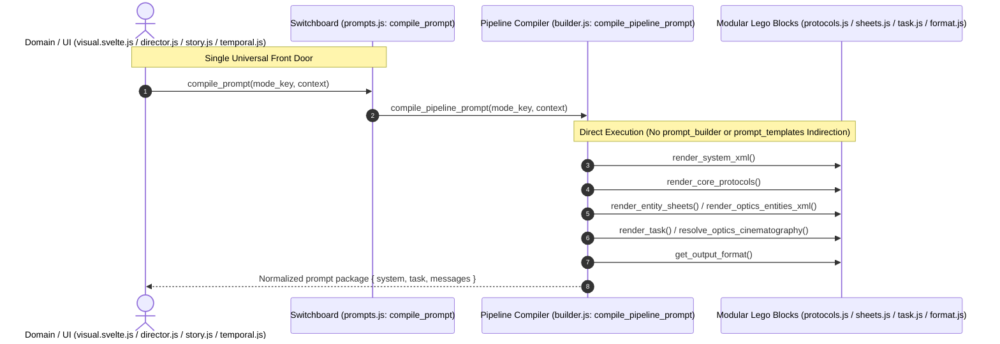

# 🎯 Track: Prompt Unification & Dead Code Elimination (Mega Report Phase 2 & Phase 3)

## 1.0 Vision & Architectural Intent

Eliminate duplicate compilation pathways, dead branches, and facade indirections across the intelligence prompt pipeline as identified in `rpglitch-mega-report.md` (spanning Reports #5, #6, and #7):

1. **Retire `prompt_templates` & Unify Optics Entry (S1, R4)**:
   - Route image prompt synthesis in `src/media/visual.svelte.js` directly through `compile_prompt("optics", context)`.
   - Delete the duplicate inline optics compilation branch (`builder.js:909-980`).
   - Thread `onAlternationPick` and dice callbacks through `compile_prompt("optics")` so interactive alternation selection is fully preserved.
   - Completely delete `prompt_templates` and remove its re-exports under P4 Zero Backwards Compatibility.
2. **Invert Recursion & Sovereign Declarative Compiler (S2)**:
   - Transform `compile_pipeline_prompt` into the sovereign renderer that calls core `render_*` modules directly without delegating to `prompt_builder`.
3. **Retire `prompt_builder` Facade (D1, D4)**:
   - Under P4 Zero Backwards Compatibility, retire the `prompt_builder` object facade and its legacy aliases (`build_character...build_epilogue`, `render_ghostwriter`).
   - Migrate all internal domain callers (`src/intelligence/director.js`, `src/intelligence/story.js`, `src/intelligence/temporal.js`, `src/intelligence/index.js`) to invoke `compile_prompt` directly.
4. **Clean Duplicate Constants & Unify Literals (D2, D3)**:
   - In `src/intelligence/modules/protocols.js`, delete or alias duplicate `HYGIENE.AFFIRMATIVE_FRAMING` (D2).
   - In `src/intelligence/modules/task.js`, import `PROSE_FORMAT` instead of declaring a duplicate string literal (D3).
5. **Standardize Output Schema Parameters & Manifest Alignment (S6, S7)**:
   - Standardize `get_output_format` option naming to `entity_type` across all call sites (S6).
   - Reconcile `enhancement` mode system role to fall back to `config.system.role || "ENHANCER"` (S7).
6. **Documentation & Test Comment Alignment (D6)**:
   - Prune stale references to legacy functions in test headers and comments.

---

## 2.0 Architectural Sequence & Data Flow

---

## 3.0 Implementation Playbook

### Phase 1: Test-Driven Red Suite

- [ ] Add unit test in `src/intelligence/prompts.test.js` verifying `compile_prompt("optics", ...)` handles both standard generation and enhancement modes with `onAlternationPick` callback support (**S1**, **R4**)
- [ ] Add unit tests verifying direct `compile_prompt` execution for `director`, `interaction`, `narrator`, `continuum`, `enhancement`, and `sorting` without `prompt_builder` (**S2**)

### Phase 2: Duplicate Elimination & Literal Cleanup (Report #7 P0)

- [ ] In `src/intelligence/modules/task.js`, import `PROSE_FORMAT` instead of using the literal string (**D3**)
- [ ] In `src/intelligence/modules/protocols.js`, reconcile duplicate `HYGIENE.AFFIRMATIVE_FRAMING` with `PROTOCOL_LIBRARY.OPTICS.AFFIRMATIVE_FRAMING` (**D2**)
- [ ] In `src/intelligence/modules/format.js` and `builder.js`, standardize `get_output_format` parameter name to `entity_type` (**S6**)
- [ ] In `src/intelligence/builder.js`, align `render_enhancement` role fallback with `config.system.role || "ENHANCER"` (**S7**)
- [ ] Prune stale doc/header mentions in test suites (**D6**)

### Phase 3: Optics Single Door & Retirement of `prompt_templates` (Report #7 P1)

- [ ] In `src/intelligence/builder.js`, delete duplicate inline optics branch in `compile_pipeline_prompt` and route `compile_prompt("optics")` to canonical optics compilation (**R4**)
- [ ] In `src/media/visual.svelte.js`, replace `prompt_templates.build_prompt` and `prompt_templates.enhance_prompt` with direct calls to `compile_prompt("optics", ...)` (**S1**)
- [ ] Delete `prompt_templates` from `src/intelligence/builder.js`, `src/intelligence/index.js`, and `src/media/index.js` under P4 Zero Backwards Compatibility (**S1**)
- [ ] Execute `svelte-autofixer` on `src/media/visual.svelte.js`

### Phase 4: Invert Recursion & Retire `prompt_builder` Facade

- [ ] In `src/intelligence/builder.js`, make `compile_pipeline_prompt` the direct renderer for all modes (**S2**)
- [ ] Migrate callers of `prompt_builder.build_director` in `src/intelligence/director.js` to `compile_prompt("director", ...)` (**D1**)
- [ ] Migrate callers of `prompt_builder.build_story_prose` in `src/intelligence/story.js` to `compile_prompt` (**D1**)
- [ ] Migrate callers of `prompt_builder.build_memory` / `build_continuum` in `src/intelligence/temporal.js` to `compile_prompt("continuum", ...)` (**D1**)
- [ ] Delete `prompt_builder` and legacy aliases from `src/intelligence/builder.js` and `src/intelligence/index.js` (**D1**)

### Phase 5: Verification & Gate

- [ ] Verify unit test suite: `npm run test:unit` (100% pass)
- [ ] Verify design tests: `npm run test:design`
- [ ] Verify hook contracts: `npm run test:hooks`
- [ ] Verify lint, audit, and type integrity: `npm run verify`
- [ ] Verify single-file production build: `npm run build`

---

<!-- CHANGELOG
- 2026-09-19: Initialized track for Mega Report Phase 2 & Phase 3 (Prompt Unification & Dead Code Elimination).
-->
