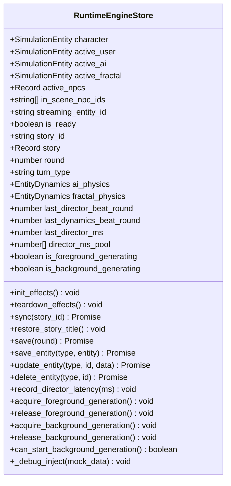

# 🎯 Track: State & UI Runes Harmonization (Svelte 5 Class Stores)

## 1.0 Vision & High-Level Architecture

Harmonize the RPGlitch state architecture by migrating legacy closure-based stores to idiomatic Svelte 5 class-based Runes stores.

Currently:

- `src/state/interface.svelte.js` uses `class InterfaceStore` with `$state` fields.
- `src/state/log.svelte.js` uses `class SimulationLogStore` with `$state` fields and `SvelteSet`.
- `src/state/status.svelte.js` uses `class SimulationStateStore` with private runes.
- `src/media/audio.svelte.js` uses `class VoiceEngine` with `$state` fields.
- **However**, `src/state/runtime.svelte.js` still uses an older factory function `create_runtime_store()` with separate local `$state(...)` variables and over 40 manual getter/setter pairs returning a plain API object.

### 1.1 Goals

1. **Refactor `src/state/runtime.svelte.js` to `class RuntimeEngineStore`**:
   - Modernize all reactive properties into direct `$state` class fields.
   - Maintain 100% downward API compatibility (`runtime.character`, `runtime.active_user`, `runtime.sync()`, `runtime.save()`, etc.).
   - Use `$derived` or getter properties for dynamic calculations (`snapshot_entities`, `snapshot_npcs`, `director_p50_ms`, `director_p95_ms`).
   - Cleanly encapsulate lifecycle effects (`#runtime_cleanup`, `init_effects()`, `teardown_effects()`).
2. **Harmonize `src/ui/Storyboard.svelte.js` (Phase 2)**:
   - Convert plain module-level let bindings (`shuffle_active`, `begin_flight_started`) into reactive `$state` fields on an exported controller.
   - Allow UI components to reactively bind to shuffle and animation states.

---

## 2.0 Technical Architecture & Class Design

---

## 3.0 Implementation Playbook

### Phase 1: Blueprint & Baseline Verification (RED/AUDIT)

- [x] `task-1.1`: Audit all methods, properties, and getters in `src/state/runtime.svelte.js` and verify against `src/state/runtime.test.js`.
- [x] `task-1.2`: Run existing test suite (`src/state/runtime.test.js`) to establish green baseline.

### Phase 2: RuntimeEngineStore Class Migration (GREEN)

- [x] `task-2.1`: Refactor `create_runtime_store()` into `export class RuntimeEngineStore` inside `src/state/runtime.svelte.js`.
- [x] `task-2.2`: Bind singleton instance `export const runtime = new RuntimeEngineStore();` and wire `window.runtime = runtime`.
- [x] `task-2.3`: Execute `svelte-autofixer` via MCP tool on `src/state/runtime.svelte.js` ensuring 0 compilation errors or rune warnings.
- [x] `task-2.4`: Run `src/state/runtime.test.js` and related state tests (`log.test.js`, `status.test.js`, `interface.test.js`, `chrono.test.js`).

### Phase 4: StoryboardController Modernization & UI Reactivity

- [x] `task-4.1`: Write unit tests for `StoryboardController` reactive properties (`is_shuffling`, `begin_flight_started`) in `src/ui/Storyboard.svelte.test.js`.
- [x] `task-4.2`: Refactor `src/ui/Storyboard.svelte.js` to `class StoryboardController` with private runes, export singleton `storyboard`, and apply UFA structure (header, section dividers, changelog).
- [x] `task-4.3`: Update `src/ui/console/StoryboardBar.svelte` to reactively disable shuffle button while `storyboard.is_shuffling`.
- [x] `task-4.4`: Run `svelte-autofixer` on `src/ui/Storyboard.svelte.js` and `src/ui/console/StoryboardBar.svelte`.
- [x] `task-4.5`: Run full test suite (`npm run test:unit`) ensuring 100% green pass.

<!-- CHANGELOG
  - 2026-09-24: Completed Phase 4 (StoryboardController Svelte 5 class refactor, SvelteSet integration, reactive StoryboardBar binding, and 1,117 unit tests passing).
  - 2026-09-24: Added Phase 4 tasks for StoryboardController modernization and reactive UI binding.
  - 2026-09-24: Initialized track file for State & UI Runes Harmonization, migrating runtime.svelte.js from closure factory to modern Svelte 5 class-based Runes store.
-->
