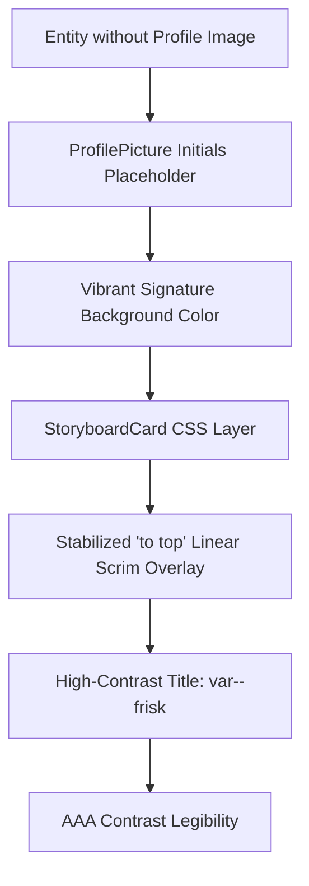

# ETERNAL: Storyboard Card Contrast & Bleed Remediation Spec

## 🎯 Objective
Remediate visual anomalies in the `StoryboardCard` component where:
1. The background of the card (especially the placeholder initials view) is fully filled with bright signature colors.
2. The dynamic overlay backdrop gradient (the linear scrim) is too shallow, skewed diagonally at `-15deg`, and extremely transparent (only 30% opacity at 35% height), allowing signature color to bleed upward and overwhelm the text block.
3. The card title `.header .primary` is styled with `var(--signature-color)`, leading to poor legibility and contrast clash (e.g., pink text on a bleeding pink background).

We will harden the storyboard card's aesthetics to conform strictly to the Nordic Collection dark-mode design system (Chalk Regime), ensuring absolute visual excellence, superb text contrast, and no diagonal bleed.

## 📊 Success Criteria
- [ ] **Robust Scrim Overlay**: Replace the `-15deg` angled gradient with a vertical `to top` linear gradient that features deeper, multi-stop backdrop coverage (e.g. from `var(--background-base)` base up to a solid opacity that thoroughly masks vibrant backgrounds behind title and description text).
- [ ] **High-Contrast Typography**: Change the card title color from `var(--signature-color)` to `var(--frisk)` (or `var(--pure-white)`). Ensure a AAA contrast ratio over the dark backdrop overlay.
- [ ] **Zero Signature Bleed**: Ensure vibrant signature colors do not leak through the backdrop gradient or impair textual legibility, while maintaining the premium, responsive edge highlight and glow aesthetics.
- [ ] **Lint and CI Purity**: Zero warnings/errors from `npm run lint`, `npm run audit`, and `npm run test`.
- [ ] **Zero Heresy**: No raw `px`, `rem`, or `#` colors introduced. Everything must map to semantic tokens.

## 🧱 Boundaries
- **Always**: Use relative pathing for files and documentation anchors.
- **Always**: Respect Svelte 5 runes (`$state`, `$derived`, `$effect`) and semantic markup.
- **Never**: Hardcode raw color values, sizing, or spacing metrics.
- **Never**: Speak, act, or think on behalf of the User in narrative components.

## 🧬 Tech Stack & Structure
- **Core UI**: [StoryboardCard.svelte](file:///c:/Users/johng/source/repos/RPGlitch/src/ui/storyboard/StoryboardCard.svelte)
- **Avatars**: [ProfilePicture.svelte](file:///c:/Users/johng/source/repos/RPGlitch/src/ui/atoms/ProfilePicture.svelte)
- **Token System**: [DESIGN.md](file:///c:/Users/johng/source/repos/RPGlitch/DESIGN.md)

## 📡 Logic Path

